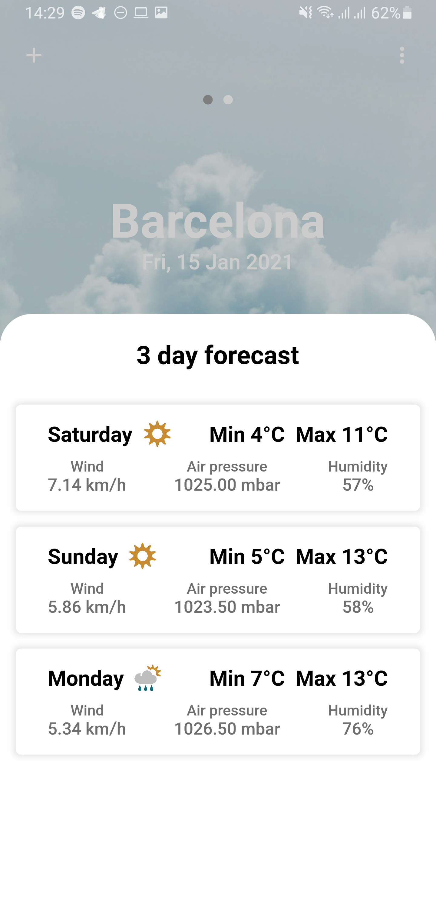

# WeatherApp

## DESING BY MAURICIO LOPEZ

### [DESIGN](https://www.behance.net/gallery/95345847/UXUI-DESIGN)

### CONTACT MAURICIO LOPEZ
- [Behance](https://www.behance.net/designylove)
- [Dribbble](https://dribbble.com/m4st3rmiau)
- [Instagram](https://www.instagram.com/maoo.lopez/)

## WEATHERAPP WITH FLUTTER
<TABLE BORDER>
    <TR>
        <TH style="text-align:center">HOME</TH>
        <TH style="text-align:center">HISTORY EMPTY</TH>
        <TH style="text-align:center">SEARCHING</TH>
    </TR>
	<TR>
		<TD></TD>
		<TD></TD>
		<TD></TD>
	</TR>
    <TR>
        <TH style="text-align:center">SEARCH RESULT</TH>
        <TH style="text-align:center">CITY WEATHER</TH>
        <TH style="text-align:center">HISTORY</TH>
    </TR>
	<TR>
		<TD></TD>
		<TD></TD>
		<TD></TD>
	</TR>
    <TR>
        <TH style="text-align:center">MATH HISTORY</TH>
        <TH style="text-align:center">NO MATH HISTORY</TH>
        <TH style="text-align:center">NO FOUND</TH>
    </TR>
	<TR>
		<TD></TD>
		<TD></TD>
		<TD></TD>
	</TR>
    <TR>
        <TH style="text-align:center">CITY WEATHER</TH>
        <TH style="text-align:center">CITY FORECAST</TH>
    </TR>
	<TR>
		<TD></TD>
		<TD></TD>
	</TR>
</TABLE>
